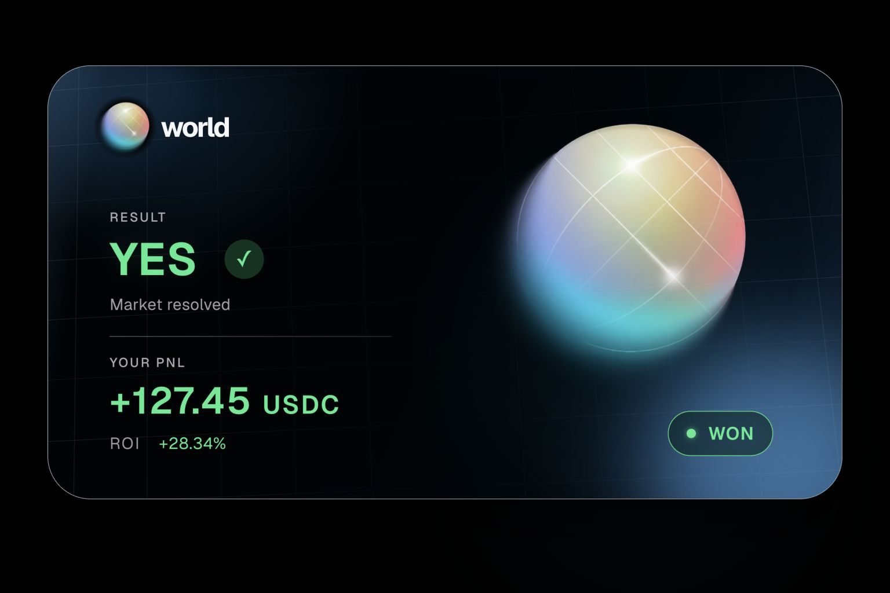
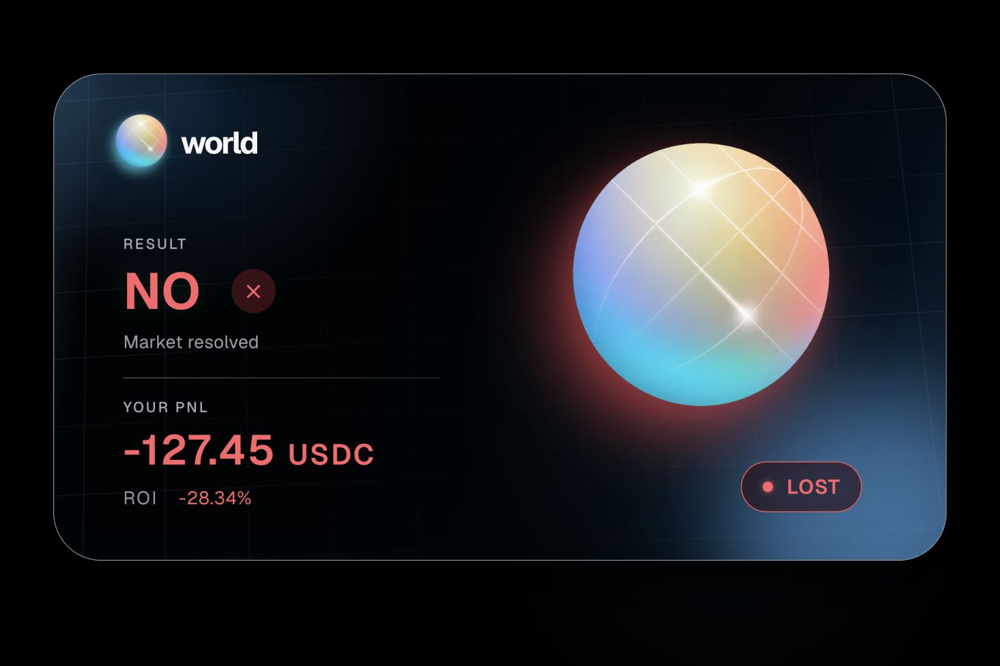

# World PnL Card

Generate a branded **World** "PnL result card" PNG for any
[World](https://app.world.org) prediction-market position — open or closed.

<p align="center">
  
  
</p>

## Hosted MCP server (recommended)

The card renderer runs as a **free, browserless MCP server** — no local install, no
Playwright. It exposes one tool, `render_pnl_card`, that turns card data into a PNG.

**Live endpoint:** `https://world-pnl-card.vercel.app/api/mcp`

```bash
claude mcp add --transport http world-pnl-card https://world-pnl-card.vercel.app/api/mcp
```

Then ask Claude to *"render a World PnL card — won, +6.52 USDC, +32.6% ROI, Spain
beats Belgium."* Source, deploy steps, and a local **stdio** variant live in
[`mcp-server/`](mcp-server/). See [`mcp-server/README.md`](mcp-server/README.md).

How it stays browserless (so it hosts anywhere for free): the decorative chrome
(gradients, glows, blur, 3D grid, planet, pill) is pre-baked into a background image
per win/lose variant, and [satori](https://github.com/vercel/satori) draws only the
dynamic text on top → [resvg](https://github.com/RazrFalcon/resvg) → PNG.

## Building the card data (on-chain)

The MCP tool renders from card fields — you supply the numbers. The World MCP
connector does not expose PnL, so realized/unrealized PnL is reconstructed from the
wallet's on-chain Solana SPL balance deltas:

```bash
node scripts/reconstruct-pnl.mjs <wallet> --json outputs/.pnl-flows.json
# map the printed candidateMints -> markets.json via the World MCP connector, then:
node scripts/reconstruct-pnl.mjs <wallet> --json outputs/.pnl-flows.json --markets markets.json
```

Pass 2 emits `positions[]`, each already shaped as the card data model
(`{ won, outcomeWord, marketTitle, marketSubtitle, statusLine, pnl, currency,
roiPercent, statusLabel }`) — feed one to `render_pnl_card`.

## Local card app (optional)

The repo also contains the original [vinext](https://www.npmjs.com/package/vinext)
card app (`app/`, rendered surface for the design) and a Playwright renderer
(`scripts/render-card.mjs`). These need **Node ≥ 22.13.0** and
`npx playwright install chromium`. The hosted MCP server supersedes them for
rendering; they remain as the design source that `scripts/bake-card.mjs` bakes from.

## Environment variables (optional)

| Var | Purpose | Default |
|---|---|---|
| `SOLANA_RPC_URL` | Private Solana RPC if the public one rate-limits | `https://api.mainnet-beta.solana.com` |
| `MCP_TOKEN` | If set on the deployed MCP server, require `Authorization: Bearer <token>` | *(unset)* |

## Notes

- USDC and CASH are both treated as $1. Buys spend USDC; redeems pay CASH.
- SOL rent/fees (~0.002 SOL) are ignored — negligible vs. position size.
- World positions are Solana SPL outcome tokens; reconstruction is Solana-only.
